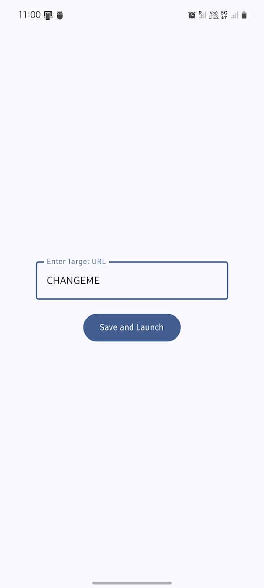
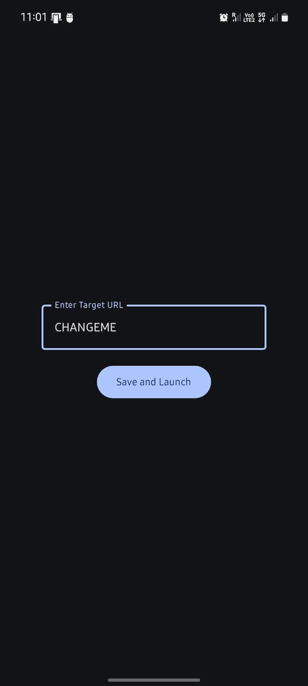

# URL Launcher

On the first launch, the app asks for the URL to launch. It will be saved in the app settings and will be used for subsequent launches.

On subsequent launches, the app will launch the URL saved in the app settings without asking for the URL again and will close automatically.

To change the URL, you can clear the app data or uninstall and reinstall the app.

  
  

## Why?

I use this app to have a quick way to open a specific discord channel on my phone. As the URL triggers the discord app to open the channel directly, I can quickly access the channel without navigating through the discord app.

The same can be done for any URL that can be opened by an app on the phone, e.g. facebook.
